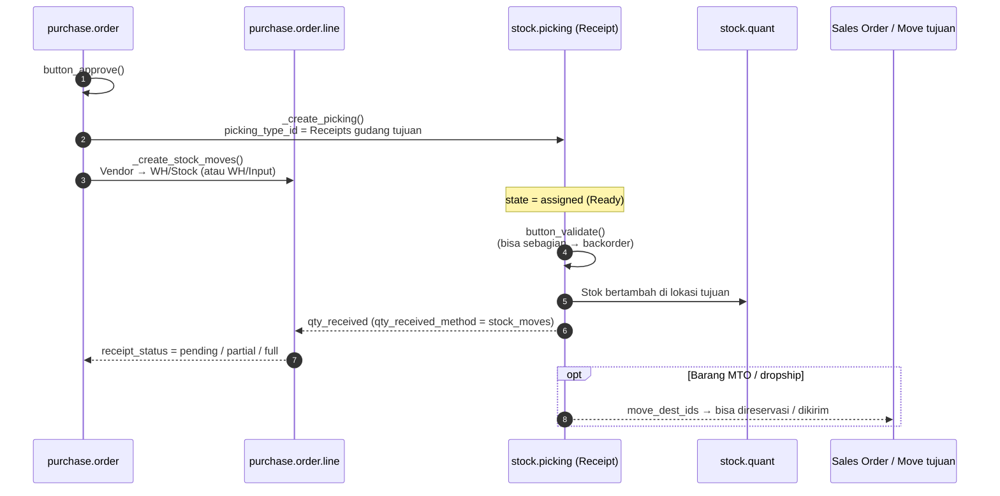

```mermaid
sequenceDiagram
    autonumber
    participant PO as purchase.order
    participant POL as purchase.order.line
    participant PK as stock.picking (Receipt)
    participant Q as stock.quant
    participant SO as Sales Order / Move tujuan

    PO->>PO: button_approve()
    PO->>PK: _create_picking()<br/>picking_type_id = Receipts gudang tujuan
    PO->>POL: _create_stock_moves()<br/>Vendor → WH/Stock (atau WH/Input)
    Note over PK: state = assigned (Ready)
    PK->>PK: button_validate()<br/>(bisa sebagian → backorder)
    PK->>Q: Stok bertambah di lokasi tujuan
    PK-->>POL: qty_received (qty_received_method = stock_moves)
    POL-->>PO: receipt_status = pending / partial / full
    opt Barang MTO / dropship
        PK-->>SO: move_dest_ids → bisa direservasi / dikirim
    end
```

---

_Sumber: dokumentasi_purchase_odoo.md §6_
