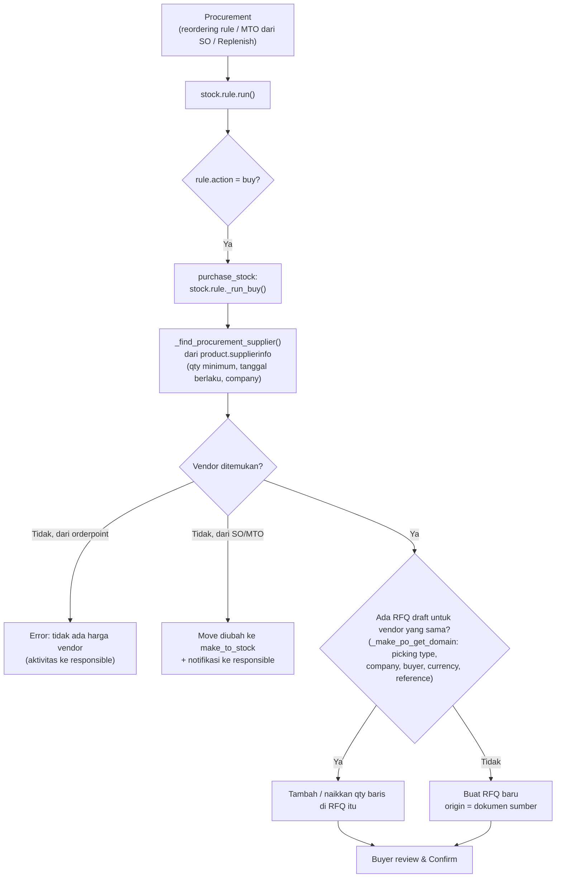

```mermaid
flowchart TB
    A["Procurement<br/>(reordering rule / MTO dari SO / Replenish)"] --> B["stock.rule.run()"]
    B --> C{"rule.action = buy?"}
    C -- Ya --> D["purchase_stock:<br/>stock.rule._run_buy()"]
    D --> E["_find_procurement_supplier()<br/>dari product.supplierinfo<br/>(qty minimum, tanggal berlaku, company)"]
    E --> F{"Vendor ditemukan?"}
    F -- Tidak, dari orderpoint --> G["Error: tidak ada harga vendor<br/>(aktivitas ke responsible)"]
    F -- Tidak, dari SO/MTO --> G2["Move diubah ke make_to_stock<br/>+ notifikasi ke responsible"]
    F -- Ya --> H{"Ada RFQ draft untuk vendor yang sama?<br/>(_make_po_get_domain: picking type,<br/>company, buyer, currency, reference)"}
    H -- Ya --> I["Tambah / naikkan qty baris di RFQ itu"]
    H -- Tidak --> J["Buat RFQ baru<br/>origin = dokumen sumber"]
    I --> K["Buyer review & Confirm"]
    J --> K
```

---

_Sumber: dokumentasi_purchase_odoo.md §8_
