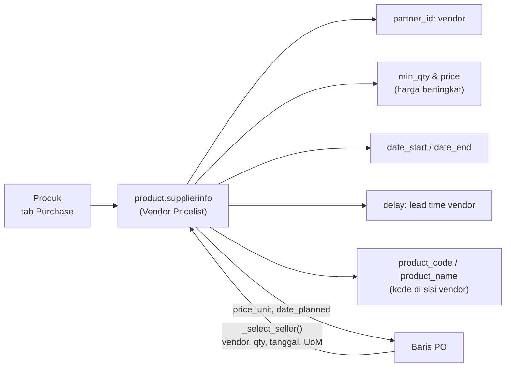

```mermaid
flowchart LR
    P["Produk<br/>tab Purchase"] --> S["product.supplierinfo<br/>(Vendor Pricelist)"]
    S --> S1["partner_id: vendor"]
    S --> S2["min_qty & price<br/>(harga bertingkat)"]
    S --> S3["date_start / date_end"]
    S --> S4["delay: lead time vendor"]
    S --> S5["product_code / product_name<br/>(kode di sisi vendor)"]

    POL["Baris PO"] -->|"_select_seller()<br/>vendor, qty, tanggal, UoM"| S
    S -->|"price_unit, date_planned"| POL
```

---

_Sumber: dokumentasi_purchase_odoo.md §9_
