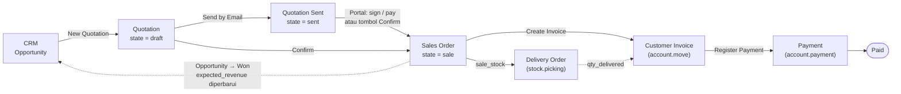

```mermaid
flowchart LR
    A["CRM<br/>Opportunity"] -->|"New Quotation"| B["Quotation<br/>state = draft"]
    B -->|"Send by Email"| C["Quotation Sent<br/>state = sent"]
    C -->|"Portal: sign / pay<br/>atau tombol Confirm"| D["Sales Order<br/>state = sale"]
    B -->|"Confirm"| D
    D -->|"sale_stock"| E["Delivery Order<br/>(stock.picking)"]
    D -->|"Create Invoice"| F["Customer Invoice<br/>(account.move)"]
    E -.->|"qty_delivered"| F
    F -->|"Register Payment"| G["Payment<br/>(account.payment)"]
    G --> H(["Paid"])
    D -.->|"Opportunity → Won<br/>expected_revenue diperbarui"| A
```

---

_Sumber: dokumentasi_sales_odoo.md §4_
