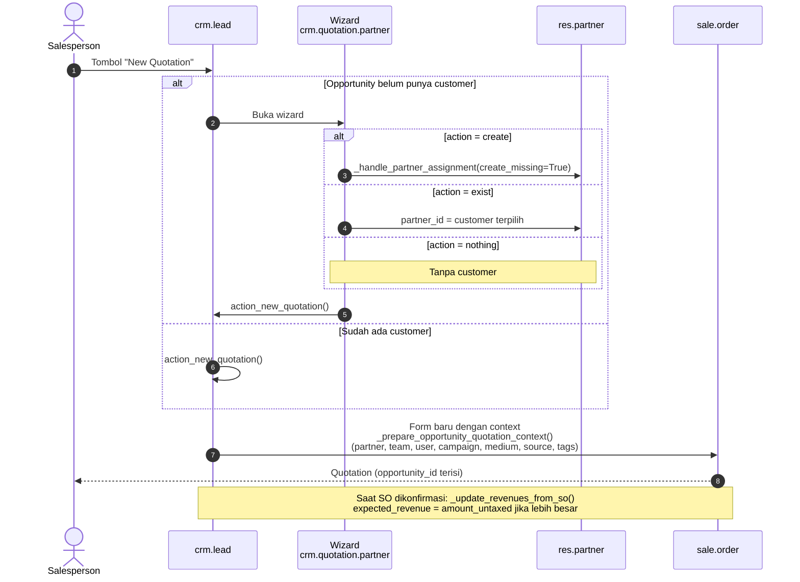

```mermaid
sequenceDiagram
    autonumber
    actor S as Salesperson
    participant L as crm.lead
    participant W as Wizard<br/>crm.quotation.partner
    participant P as res.partner
    participant SO as sale.order

    S->>L: Tombol "New Quotation"
    alt Opportunity belum punya customer
        L->>W: Buka wizard
        alt action = create
            W->>P: _handle_partner_assignment(create_missing=True)
        else action = exist
            W->>P: partner_id = customer terpilih
        else action = nothing
            Note over W,P: Tanpa customer
        end
        W->>L: action_new_quotation()
    else Sudah ada customer
        L->>L: action_new_quotation()
    end
    L->>SO: Form baru dengan context<br/>_prepare_opportunity_quotation_context()<br/>(partner, team, user, campaign, medium, source, tags)
    SO-->>S: Quotation (opportunity_id terisi)
    Note over L,SO: Saat SO dikonfirmasi: _update_revenues_from_so()<br/>expected_revenue = amount_untaxed jika lebih besar
```

Di opportunity, smart button menampilkan jumlah **Quotations** (`draft`, `sent`) dan **Orders** (selain `draft`, `sent`, `cancel`).

---

_Sumber: dokumentasi_sales_odoo.md §5_
