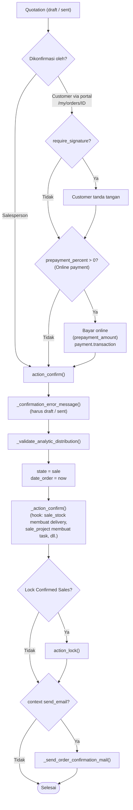

```mermaid
flowchart TB
    A["Quotation (draft / sent)"] --> B{"Dikonfirmasi oleh?"}
    B -- "Salesperson" --> C["action_confirm()"]
    B -- "Customer via portal<br/>/my/orders/ID" --> P1{"require_signature?"}
    P1 -- Ya --> P2["Customer tanda tangan"]
    P1 -- Tidak --> P3
    P2 --> P3{"prepayment_percent > 0?<br/>(Online payment)"}
    P3 -- Ya --> P4["Bayar online<br/>(prepayment_amount)<br/>payment.transaction"]
    P3 -- Tidak --> C
    P4 --> C

    C --> D["_confirmation_error_message()<br/>(harus draft / sent)"]
    D --> E["_validate_analytic_distribution()"]
    E --> F["state = sale<br/>date_order = now"]
    F --> G["_action_confirm()<br/>(hook: sale_stock membuat delivery,<br/>sale_project membuat task, dll.)"]
    G --> H{"Lock Confirmed Sales?"}
    H -- Ya --> I["action_lock()"]
    H -- Tidak --> J
    I --> J{"context send_email?"}
    J -- Ya --> K["_send_order_confirmation_mail()"]
    J -- Tidak --> L(["Selesai"])
    K --> L
```

---

_Sumber: dokumentasi_sales_odoo.md §6_
