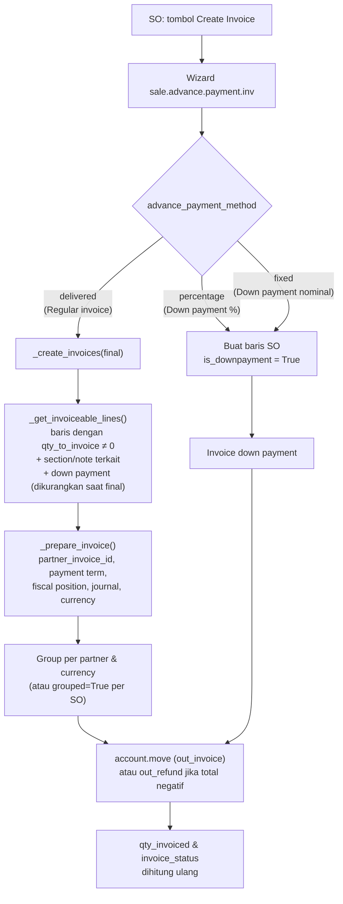

```mermaid
flowchart TB
    A["SO: tombol Create Invoice"] --> W["Wizard sale.advance.payment.inv"]
    W --> M{"advance_payment_method"}
    M -- "delivered<br/>(Regular invoice)" --> R["_create_invoices(final)"]
    M -- "percentage<br/>(Down payment %)" --> DP["Buat baris SO<br/>is_downpayment = True"]
    M -- "fixed<br/>(Down payment nominal)" --> DP
    DP --> DPI["Invoice down payment"]

    R --> R1["_get_invoiceable_lines()<br/>baris dengan qty_to_invoice ≠ 0<br/>+ section/note terkait<br/>+ down payment (dikurangkan saat final)"]
    R1 --> R2["_prepare_invoice()<br/>partner_invoice_id, payment term,<br/>fiscal position, journal, currency"]
    R2 --> R3["Group per partner & currency<br/>(atau grouped=True per SO)"]
    R3 --> R4["account.move (out_invoice)<br/>atau out_refund jika total negatif"]
    DPI --> R4
    R4 --> R5["qty_invoiced & invoice_status<br/>dihitung ulang"]
```

---

_Sumber: dokumentasi_sales_odoo.md §8_
